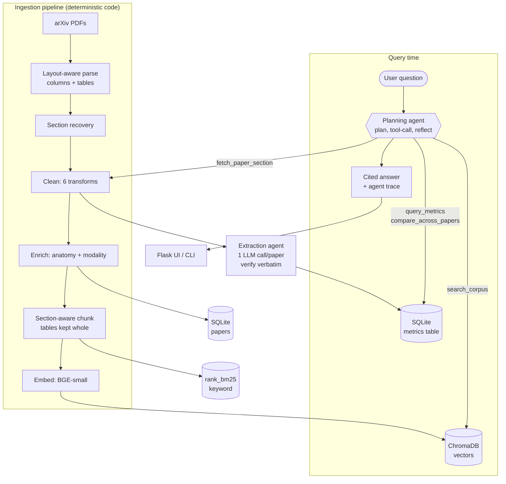

# Agentic Research Assistant for Segmentation Literature

A research assistant over medical-imaging segmentation literature. It ingests a
corpus of papers, extracts the reported results into a structured, queryable
table, and answers questions about them with citations. For harder questions it
plans multiple steps, calls tools, checks its own evidence, and then answers.

The project came out of working on AI + medTech research, where finding specific
results across a large body of segmentation papers is slow. The information is
there, but it is scattered across tables, prose, and appendices in inconsistent
formats: which architecture, on which dataset, with what Dice score, over how
many cases. This tool makes that searchable instead of manual.

The question it is built to answer:

> *Which architectures report the best Dice on head-and-neck segmentation, on
> which datasets, and how many cases was each evaluated on?*

That single query needs multi-step retrieval, numeric extraction from messy
tables, and comparison across papers. Plain embed-and-retrieve RAG cannot do it,
and getting it to work is the core of the project.

## Status

The end-to-end system works. The full ingestion pipeline (acquire through index)
is done and validated, the corpus is queryable through a vector store and a
keyword store with a labelled retrieval eval, the reported results are extracted
into a verified metrics table, and the hand-written multi-step agent answers
questions over all of it with citations, served both from a CLI and a Flask UI.
It is containerised with a GitHub Actions CI/CD pipeline. The one remaining piece
is the LangGraph re-implementation and head-to-head comparison (see the roadmap).

To be clear about what this is not: it is a working system with measured results,
not a production service. There is no monitoring, auth, or unattended operation.
It runs on Groq's free tier, so a full evaluation run is paced across daily token
budgets rather than executed in one shot.

## Architecture

Ingestion is deterministic code (top); the two agents (metric extraction and the
planning agent) are the only parts that call an LLM. At query time the planning
agent reads the three stores through tools and answers with citations.



## Where it stands right now

The pipeline turns raw PDFs into clean, section-aware, layout-faithful text, and
the output is checked against the source rather than assumed correct.

| | |
|---|---|
| Papers acquired | 276 (arXiv) |
| Usable after dedup / OCR filter | 275 |
| Excluded (scanned, no text layer) | 1 |
| Exact / near duplicates found | 0 |
| Year range | 2011 to 2026 |
| Results tables extracted | 732 |
| Two-column pages reconstructed | 2,435 |
| Papers with a Results / Experiments section | 250 (91%) |
| Parse text coverage vs. source PDFs | 0.9997 mean (min 0.987) |
| Table numeric fidelity (values that trace back to source) | 100% |
| Cleaning: headers/footers and equations stripped | 3,093 / 1,181 |
| Result numbers retained through cleaning | 98.3% (rest are page numbers) |
| Chunks produced (section-aware, 400-token) | 8,139 (732 whole tables) |
| Chunks embedded (BGE-small, 384-dim, cached) | 8,139 |
| Retrieval stores | ChromaDB + rank_bm25 + SQLite |

The corpus is weighted toward head-and-neck, organs-at-risk, orbital/ocular, and
small-structure segmentation, with a minority of broader-AI work (diffusion
models, foundation/SAM segmentation, general segmentation, AI-in-medtech) so
there is real architectural variety to compare.

## How the pipeline works

Most of this is plain deterministic code, not LLM calls, because hashing,
parsing, and chunking are faster, cheaper, and reproducible as ordinary code.
Only the parts that genuinely need judgement get an agent.

1. **Acquire:** pull papers from the arXiv API, one request every 3 seconds with
   backoff, trusting the API for metadata (title, authors, year, DOI) instead of
   scraping it from the PDF. Restartable: it skips anything already downloaded.
2. **Manifest + dedup:** SHA-256 fingerprint every PDF and normalize titles, so a
   preprint and its published version collapse to one record. This file also
   tracks how far each paper has moved through the pipeline.
3. **Parse (layout-aware):** read font size, boldness, and position of every text
   block, detect columns, and rebuild proper reading order. Two-column papers
   read straight across into nonsense otherwise. Tables come out separately, as
   structured rows, since that is where the scores live and flattening them
   destroys the numbers. Scanned PDFs are detected and set aside.
4. **Structure recovery:** group blocks into sections (Abstract, Methods,
   Results, and so on) using the font signals plus a section-name regex, and cut
   everything after References so the bibliography does not pollute retrieval.
5. **Clean:** apply six ordered transforms per section (Unicode NFKC,
   de-hyphenate across line breaks, strip repeated headers/footers, join
   paragraph lines, replace display equations with a token, collapse whitespace),
   logging what each removes. Tables are left untouched, and the equation filter
   is tuned to never mistake a result row (`0.88 ± 0.02`) for an equation.
6. **Enrich (one cheap LLM call/paper):** label each paper's anatomical target
   and imaging modality from its abstract, as controlled-vocabulary metadata for
   filtered retrieval ("search only CT head-and-neck papers"). The one part of
   ingestion that needs judgement rather than rules.
7. **Chunk (section-aware):** split sections into retrieval units, measured with
   the embedding model's own tokenizer. Chunks never span sections, tables are
   kept whole, and IDs are deterministic (`{paper_id}::{section}::{index}`) so
   the retrieval gold set stays valid across runs. Sized to the model's real
   512-token limit, not the spec's 800, since BGE-small silently truncates longer
   inputs.
8. **Embed (contextual):** prepend title + section to each chunk (for the vector
   only; display text unchanged), embed with BGE-small in batches of 64,
   L2-normalized. Vectors are cached by content hash so a re-run only embeds
   changed chunks; the model + dimension are recorded so two embedding models can
   never silently mix.
9. **Index:** load vectors into ChromaDB (with paper_id / section / year /
   anatomy / modality as filter metadata), build a persisted rank_bm25 keyword
   index over the same chunks, and populate a SQLite papers table. Vectors for
   semantic similarity, BM25 for exact metric and architecture names.
10. **Validation:** before trusting any of the above, compare the parsed output
    word for word against the raw PDFs and verify that extracted table numbers
    actually appear in the source. Results are saved to
    `data/parse_validation.json`.

On top of this ingestion pipeline sit the two things that make it a research
assistant rather than a search box: a verified metric-extraction agent that
turns the reported results into a structured, queryable table, and a
hand-written planning agent that answers questions over it (both described
below).

## Stack

Python 3.12, PyMuPDF, sentence-transformers (BGE-small), ChromaDB, rank_bm25,
bge-reranker cross-encoder, SQLite, Groq (gpt-oss-120b, free tier), Flask,
Docker / AWS.

The LLM sits behind a one-file wrapper (`src/llm.py`), so the provider is a
single-line change. I use Groq's free tier rather than a paid API; the
architecture is provider-agnostic.

One deliberate choice worth calling out: the agent loop is hand-written on the
LLM's tool-calling API (OpenAI-compatible), not LangChain or LangGraph. The goal
was to understand tool calling at the API level rather than hide it behind a
framework. A later phase re-implements it in LangGraph specifically to compare
the two.

## Setup

```bash
python -m venv venv
.\venv\Scripts\Activate.ps1          # Windows PowerShell
pip install -r requirements.txt

copy .env.example .env               # then add your free GROQ_API_KEY
```

Run the pipeline stages (each is restartable and idempotent):

```bash
python -m src.acquire_arxiv          # download the corpus (~25 min, rate limited)
python -m src.manifest               # fingerprint + dedup
python -m src.parse                  # layout-aware parsing
python -m src.structure              # section recovery
python -m src.clean                  # text cleaning
python -m src.enrich                 # LLM metadata (anatomy + modality)
python -m src.chunk                  # section-aware chunking
python -m src.embed                  # contextual embedding (BGE-small, cached)
python -m src.index                  # build Chroma + BM25 + SQLite stores
python -m src.extract                # metric extraction (Agent 2; resumable per day)
python -m src.validate_parse         # QA report vs. source PDFs
python -m src.eval_retrieval         # retrieval eval (recall@5, paper-hit@5)
```

Sanity-check any single paper against its PDF:

```bash
python -m src.validate_parse --paper arxiv_1808.05238
```

Ask the assistant (CLI or web UI):

```bash
python -m src.agent "Which architectures report the best Dice on head and neck segmentation?"
python -m src.app     # then open http://localhost:5000
```

## Deployment

Containerised with a multi-stage `Dockerfile`: CPU-only torch and the embedding
model are baked in, but no secrets and no `data/` are, so the image stays generic.

Run it locally (the Groq key comes from the environment, the index/DB is mounted):

```bash
docker build -t seg-assistant .
docker run -e GROQ_API_KEY=gsk_... -v "$(pwd)/data:/app/data:ro" -p 5000:5000 seg-assistant
```

CI/CD is a GitHub Actions workflow (`.github/workflows/deploy.yml`): on push to
`main` it builds the image, pushes it to Amazon ECR, and deploys it on an EC2
instance over SSH, finishing with a `/health` check that fails the deploy if the
app didn't come up. Every credential (AWS keys, EC2 host/key, Groq key) lives in
GitHub Secrets. The `data/` layer ships to the instance separately (scp or S3
sync) and is mounted read-only, per the "don't rebuild the index in the container"
rule.

The Docker and CI/CD configuration is complete and tested locally; live AWS
provisioning is intentionally left as a manual step to avoid idle billing (set a
budget alert and tear the instance down after a demo).

## Repository layout

```
data/
  raw/            source PDFs + API metadata (immutable, re-downloadable)
  parsed/         page-level blocks with layout info
  clean/          section-structured, cleaned text
  chunks/         final chunks with metadata
  index/          chroma collection + bm25 index
  manifest.jsonl  per-paper record + pipeline status
  app.db          sqlite: papers + extracted metrics table
src/              pipeline + agent code
templates/        Flask UI (query, cited answer, collapsible trace)
evals/            retrieval + end-to-end evaluation sets
NOTES.md          plain-language design log, the reasoning behind each decision
```

`data/raw` is immutable on purpose: everything downstream is reproducible from
it, so a chunking change means re-running from `parsed/`, never re-downloading.

## Retrieval evaluation

52 questions labelled with gold chunk IDs (41 single-hop lookups, 11 comparative
multi-hop), scored with `python -m src.eval_retrieval`:

| method | chunk recall@5 | paper hit@5 | MRR | single-hop r@5 | multi-hop r@5 |
|---|--:|--:|--:|--:|--:|
| vector | 0.468 | 0.846 | 0.28 | 0.585 | 0.030 |
| bm25 | 0.000 | 0.827 | 0.00 | 0.000 | 0.000 |
| hybrid (RRF) | 0.019 | 0.846 | 0.04 | 0.024 | 0.000 |
| rerank | 0.404 | 0.827 | 0.25 | 0.512 | 0.000 |

Two findings drove the design:

- **Dense vector retrieval is the strongest method here, and adding BM25 or a
  cross-encoder reranker did not help exact-chunk recall (they hurt it).** The
  answers live in number-heavy result tables: BM25 can't keyword-match them, the
  cross-encoder ranks them below prose, and RRF rewards the prose both agree on.
  Measured, not assumed. Paper-level hit@5 stays ~0.85 for every method (the
  right *document* is found regardless), which is the signal the agent needs, so
  the design uses vector for chunk retrieval and BM25/hybrid as a paper-level
  signal, and drops the reranker (no gain, and far too slow on CPU).
- **Every single-query method scores ~0.03 on the multi-hop questions.** A
  comparative question ("which architectures work best for head-and-neck?") needs
  tables from several papers, which one query embedding cannot gather. This is the
  ceiling that motivates the multi-step agent.

## Metrics glossary

Two different families of numbers appear in this project. The first is data the
system extracts; the second is how the system grades itself.

**Metrics reported inside the papers (extracted, not computed here):**

- **Dice / DSC (Dice Similarity Coefficient):** overlap between the predicted and
  ground-truth masks, `2|P and G| / (|P| + |G|)`, scored 0 to 1 (higher is
  better). The dominant segmentation metric; "Dice" and "DSC" are the same thing,
  so the agent treats them as synonyms.
- **IoU / Jaccard:** overlap over union, `|P and G| / |P or G|`. Same idea as
  Dice but stricter, always lower than Dice for the same masks.
- **HD95 (95th-percentile Hausdorff Distance):** worst-case boundary error in mm,
  ignoring the top 5% of outliers. A distance, so lower is better. Each value is
  stored with its **case count**, because a score on 300 cases is stronger
  evidence than the same score on 12.

**Metrics that grade this system:**

- **recall@5:** fraction of the gold answer-chunks that appear in the top 5
  retrieved results. Measures whether the right evidence reaches the model.
- **paper-hit@5:** whether the right *paper* is in the top 5, even if the exact
  chunk is missed. Added to separate "found the document" from "found the exact
  table", which is what explained why keyword and reranking methods behaved as
  they did.
- **MRR (Mean Reciprocal Rank):** `1/rank` of the first correct hit, averaged.
  Rewards ranking the answer near the top, not just somewhere in the list.
- **faithfulness / completeness / citation (1 to 5):** an LLM judge grades each
  final answer, faithfulness against the gold evidence (a number not in the
  evidence is a hallucination), completeness for coverage, citation for whether
  claims are traced to a paper_id.
- **tokens and latency per query:** the cost side. These quantify the agent's
  overhead versus plain retrieval, so the trade-off is explicit rather than
  assumed.
- **extraction verification catch rate:** the share of extracted numbers
  discarded because they were not found verbatim in the source. This is the
  anti-hallucination guarantee behind the metrics table.

## Roadmap

- [x] Acquisition, manifest + dedup
- [x] Layout-aware parsing (columns, tables, OCR detection) + validation
- [x] Structure recovery (sections, reference truncation)
- [x] Cleaning (NFKC, de-hyphenation, header/footer and equation stripping)
- [x] Metadata enrichment (anatomy + modality via LLM, for filtered retrieval)
- [x] Section-aware chunking (deterministic IDs, sized to the 512-token model)
- [x] Embedding + indexing (ChromaDB vectors + BM25 keyword + SQLite)
- [x] Retrieval + labelled 52-question eval (recall@5, paper-hit@5, MRR)
- [x] Verified metric extraction (Agent 2) into a SQLite metrics table
- [x] Hand-written planning / tool-calling agent (no LangChain/LangGraph)
- [x] Flask interface (query -> cited answer -> collapsible agent trace)
- [x] Docker image + GitHub Actions CI/CD (build -> ECR -> EC2); config ready
- [ ] LangGraph re-implementation and a head-to-head comparison

## Known limitations (so far)

- Corpus is arXiv-only for now. PubMed Central is a planned second source.
- `find_tables()` occasionally merges cells on complex tables. The values are
  always correct (verified), but the grid structure is not always perfect. The
  metric-extraction agent is designed to handle this by also reading the prose.
- Two papers have no detectable section headings (unusual formatting) and are
  flagged for a parse-repair pass.
- One scanned paper is excluded. Scanned cases are detected and skipped rather
  than ingested as empty text.
